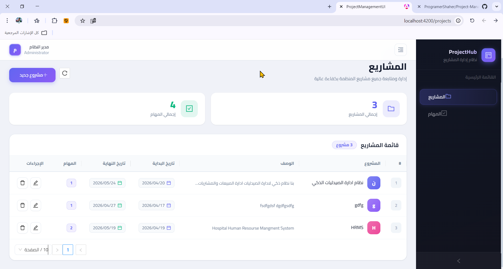

# نظام إدارة المشاريع (Project Management System)

نظام متكامل لإدارة المشاريع والمهام، تم تصميمه وبناؤه بأحدث التقنيات مع التركيز على المعمارية النظيفة (Clean Architecture) وتجربة المستخدم (UX/UI) العصرية.




## 🌟 الميزات الرئيسية

*   **إدارة المشاريع:** يتيح النظام إنشاء المشاريع وتتبعها وتحديد فتراتها الزمنية بفعالية.
*   **إدارة المهام:** يمكن إضافة المهام وربطها بالمشاريع، مع إمكانية التحكم في حالاتها المختلفة (قيد الانتظار، قيد التنفيذ، مكتملة).
*   **معالجة التواريخ الذكية:**
    *   يمنع إضافة مهام بتواريخ تقع خارج النطاق الزمني المحدد للمشروع.
    *   يمنع تداخل التواريخ وتجاوز تاريخ الاستحقاق لتاريخ البداية، مما يضمن دقة الجدولة.
*   **واجهة مستخدم عصرية (Premium UI):** تصميم احترافي وجذاب باستخدام Angular 21 و NG-ZORRO، مع دعم كامل للغة العربية (RTL).
*   **أداء عالي:** واجهة أمامية تعتمد كلياً على Signals لضمان استجابة سريعة، وخلفية مبنية بـ .NET مع تطبيق الـ Repository Pattern لتحقيق كفاءة عالية.

## 🛠 التكنولوجيا المستخدمة (Tech Stack)

### Backend (.NET API)

| المكون        | التفاصيل                                        |
| :------------ | :---------------------------------------------- |
| **Framework** | ASP.NET Core Web API (أحدث إصدار)              |
| **Architecture** | N-Tier Architecture (Controllers, Services, Repositories) |
| **Database**  | SQL Server مع Entity Framework Core             |
| **Patterns**  | Dependency Injection, Repository Pattern, DTO (Data Transfer Objects), Global Exception Handling |
| **Libraries** | AutoMapper, PagedList                           |

### Frontend (Angular)

| المكون        | التفاصيل                                        |
| :------------ | :---------------------------------------------- |
| **Framework** | Angular 21 (Standalone Components)              |
| **State Management** | Angular Signals                                 |
| **UI Library** | NG-ZORRO (Ant Design for Angular)               |
| **Styling**   | CSS/SCSS (Custom Premium Tokens)                |
| **HTTP**      | Interceptors لمعالجة الأخطاء والرسائل          |

## ⚙️ متطلبات التشغيل (Prerequisites)

لتشغيل النظام، يجب توفر المتطلبات التالية:

*   **.NET SDK**
*   **Node.js** (إصدار حديث)
*   **SQL Server**

## 🚀 كيفية التشغيل (Getting Started)

للبدء في تشغيل النظام، اتبع الخطوات التالية:

### 1. إعداد الـ Backend (الخادم)

1.  افتح الطرفية (Terminal) وانتقل إلى مجلد: `Backend/ProjectManagement.Api`.
2.  قم بتحديث قاعدة البيانات (Migrations) باستخدام الأمر التالي:

    ```bash
    dotnet ef database update
    ```

3.  قم بتشغيل الخادم:

    ```bash
    dotnet run
    ```

    سيتم تشغيل الـ API في الغالب على `https://localhost:7298`. يمكنك التحقق من واجهة Swagger عبر إضافة `/swagger` إلى الرابط.

### 2. إعداد الـ Frontend (الواجهة)

1.  افتح طرفية جديدة وانتقل إلى مجلد `Frontend/ProjectManagement-UI`.
2.  قم بتثبيت الحزم المطلوبة:

    ```bash
    npm install
    ```

3.  قم بتشغيل خادم التطوير لـ Angular:

    ```bash
    ng serve -o
    ```

4.  افتح المتصفح على الرابط: `http://localhost:4200`.

## 📁 هيكلية المشروع (Project Structure)

تم تنظيم المشروع بعناية لضمان سهولة الصيانة والتوسع:

### Frontend Structure

```text
src/
├── app/
│   ├── core/           # النماذج، خدمات الاتصال (API Services)، Interceptors
│   ├── layout/         # الهيكل الأساسي للتطبيق (Sidebar, Header)
│   ├── features/       # مكونات النظام الرئيسية
│   │   ├── projects/   # شاشة عرض المشاريع ونموذج الإضافة والتعديل
│   │   └── tasks/      # شاشة عرض المهام والفلترة
│   └── app.routes.ts   # موجه التطبيق
└── styles.scss         # الإستايلات الأساسية لنظام التصميم المتكامل (Tokens)
```

### Backend Structure

```text
ProjectManagement.Api/
├── Controllers/        # واجهات التحكم (Endpoints) للـ API
├── Models/
│   ├── Entities/       # كيانات قاعدة البيانات المباشرة
│   └── DTOs/           # كائنات تبادل البيانات
├── Repositories/       # طبقة التفاعل مع الـ Database (I...Repository & Implementation)
├── Services/           # طبقة الأعمال واللوجيك (التحقق من التواريخ وإدارة الـ DTOs)
└── Wrappers/           # تغليفات الاستجابات مثل PagedList و ApiResponse
```

---
مبني بإتقان وحب وشغف للبرمجة واهتمام بإنتاج كود نظيف واحترافي. ❤️
```
